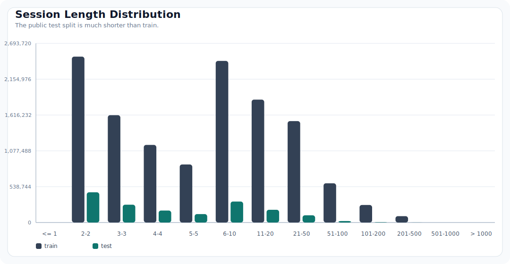
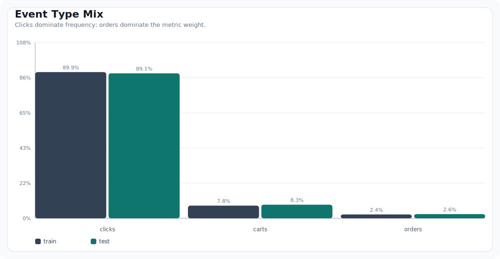
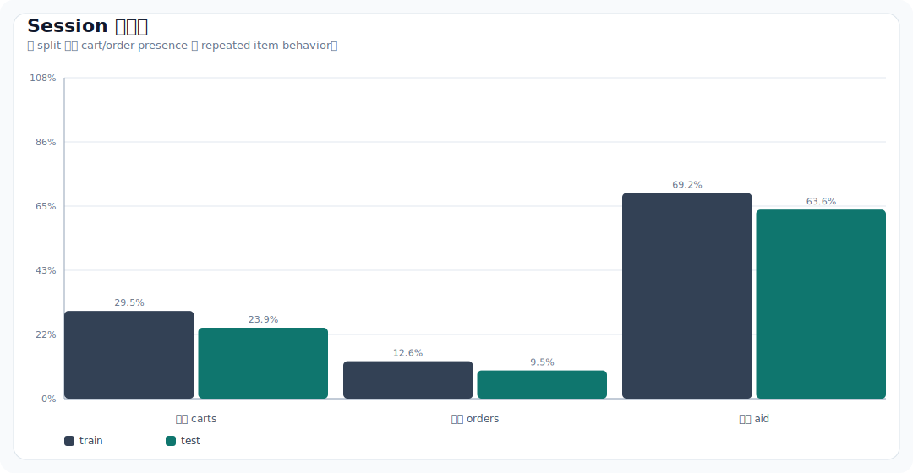
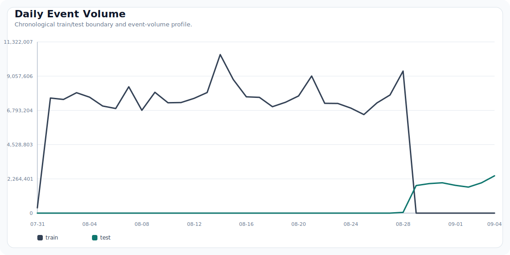
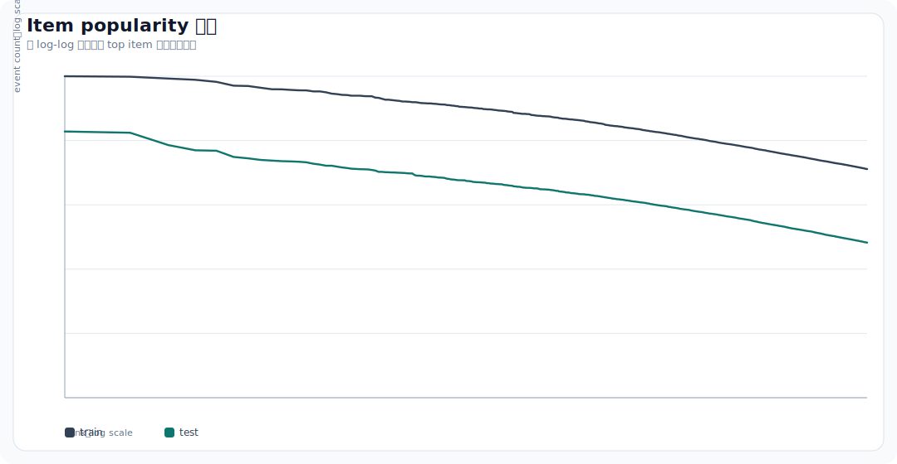
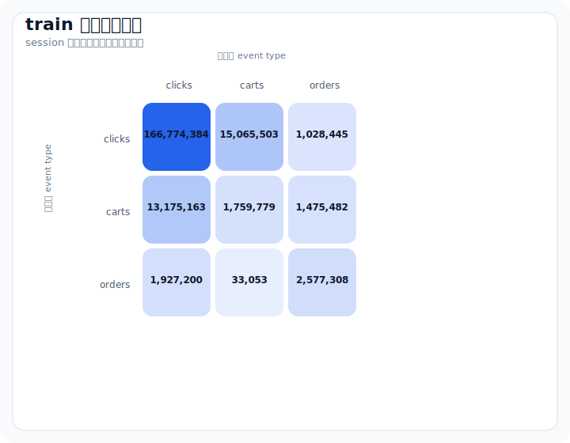
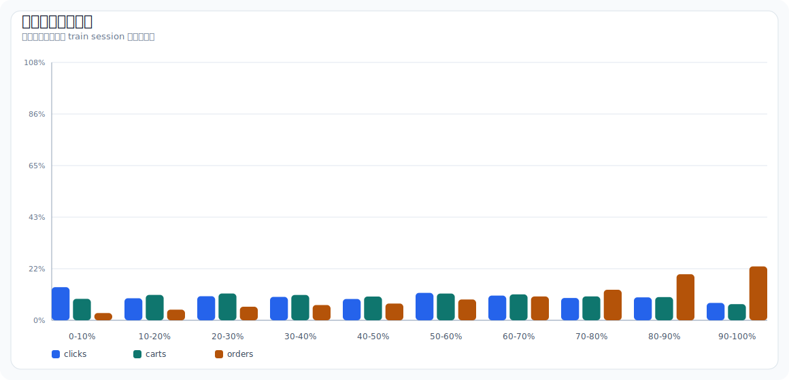

# 数据与 EDA

## 一句话结论

本页汇总 Kaggle OTTO session 数据集的全量 EDA。这里的 EDA 不只是“看分布”，而是为后续工程做侦察：每个统计都应该验证字段口径、暴露建模风险，或指向明确的 baseline、candidate、feature、validation 决策。

核心发现：

- 任务强依赖 session 内行为：重复 item 交互非常常见，session history 应作为第一候选源。
- public test session 明显短于 train，短 session fallback 必须单独设计。
- clicks 占事件量大头，但 orders 占指标权重大头，需要 target-specific 候选与排序。
- item popularity 极度长尾，热门 fallback 有价值但远远不够。
- train/test 是时间相邻窗口，验证必须按时间切分，并显式做泄漏检查。

## 特征侦察摘要

| EDA 信号 | 说明 | 候选或特征动作 |
| :-- | :-- | :-- |
| test session 更短 | test 平均长度 8.29，train 平均长度 16.80；test p50 只有 4 个事件 | 建立短 session 路径：recent unique aids + target-specific popularity + recent popularity |
| 重复 `aid` 很常见 | 69.20% 的 train session、63.61% 的 test session 重复出现同一 item | 增加 `aid_count_in_session`、`last_seen_rank`、`first_seen_rank`、repeated-aid flag |
| orders 更靠近 session 后段 | train 中 54.66% 的 order、test 中 73.75% 的 order 出现在 session 最后 30% | order candidate 和 ranking 更重视 late-session event |
| cart-to-order 转移有信息量 | `cart->order` 条件概率 train 为 8.99%，test 为 9.77% | 构建 cart-to-order co-visitation 与 cart/order-specific item features |
| 热门 item 漂移明显 | train/test top100 item overlap 为 47，Jaccard 为 0.3072 | 对比 global、recent-window、target-specific popularity |
| test 无冷启动 item | test 中 100% 的 `aid` 都在 train 出现过 | 候选生成可重点利用已观测 item graph，cold-start 不是主要矛盾 |

## 全量数据规模

| split | sessions | events | unique_aids | min_ts_utc | max_ts_utc |
| :-- | --: | --: | --: | :-- | :-- |
| train | 12,899,779 | 216,716,096 | 1,855,603 | 2022-07-31T22:00:00.025000+00:00 | 2022-08-28T21:59:59.984000+00:00 |
| test | 1,671,803 | 13,851,293 | 1,019,357 | 2022-08-28T22:00:00.278000+00:00 | 2022-09-04T21:59:59.984000+00:00 |

## 字段口径

| 字段 | 粒度 | 类型 | 含义 | 下游用途 |
| :-- | :-- | :-- | :-- | :-- |
| `session` | session | integer | 匿名 session id | group key、验证标签 key、submission key |
| `events` | session | list | 按时间排序的事件序列 | session history、序列特征 |
| `aid` | event | integer | item id | candidate id、item features、co-visitation entity |
| `ts` | event | integer | 毫秒级时间戳 | 时间切分、recency、drift、co-visitation window |
| `type` | event | string | `clicks`、`carts`、`orders` | target labels、权重、行为特征 |

推荐事件级表结构：

```text
session:int64, aid:int64, ts:int64, type:string, event_idx:int32
```

## Session 长度



| split | mean | p50 | p75 | p90 | p95 | p99 | max |
| :-- | --: | --: | --: | --: | --: | --: | --: |
| train | 16.80 | 6 | 15 | 39 | 68 | 176 | 500 |
| test | 8.29 | 4 | 8 | 18 | 28 | 64 | 498 |

特征影响：

- 短 session 需要单独逻辑，因为历史行为太少，排序依据不足。
- recent unique session items 应作为第一层 baseline source。
- co-visitation 与特征任务要对超长 session 做截断或分批，避免长尾 runtime spike。

### Session 意图分层

| split | clicks only | clicks+carts | clicks+carts+orders | clicks+orders |
| :-- | --: | --: | --: | --: |
| train | 70.18% | 17.21% | 12.33% | 0.28% |
| test | 75.82% | 14.68% | 9.18% | 0.32% |

解读：

- 大多数 session 只有 clicks，模型必须能处理弱意图场景。
- 同时包含 carts 与 orders 的 session 占比不高，但对最终指标价值很高。
- 应显式做 intent segmentation：短 click-only session、cart session、purchase-intent session 不应完全共用同一套候选混合比例。

## 行为类型分布



| split | clicks | carts | orders | clicks_ratio | carts_ratio | orders_ratio |
| :-- | --: | --: | --: | --: | --: | --: |
| train | 194,720,954 | 16,896,191 | 5,098,951 | 89.85% | 7.80% | 2.35% |
| test | 12,340,303 | 1,155,698 | 355,292 | 89.09% | 8.34% | 2.57% |

特征影响：

- 指标必须按 target 单独汇报，weighted recall 可能掩盖局部退化。
- orders 稀疏但高价值，需要单独检查 order-oriented candidate coverage。
- event type 应是一等特征，而不是事后展示标签。

## Session 级信号



| split | 包含 carts 的 sessions | 包含 orders 的 sessions | 重复 aid sessions | mean unique aids/session | p50 duration sec | p95 duration sec |
| :-- | --: | --: | --: | --: | --: | --: |
| train | 29.54% | 12.61% | 69.20% | 10.36 | 185618 | 2090394 |
| test | 23.86% | 9.50% | 63.61% | 5.30 | 757 | 330819 |

特征影响：

- repeated-aid 行为支持 count、recency、last-seen-position 特征。
- carts/orders presence 可用于定义 session intent segment。
- session duration 与 time gap 可帮助区分快速浏览和深度购买意图。

### 首尾事件类型

| split | first click | first cart/order | last click | last cart | last order |
| :-- | --: | --: | --: | --: | --: |
| train | 99.57% | 0.43% | 91.88% | 3.77% | 4.35% |
| test | 99.61% | 0.39% | 90.27% | 4.21% | 5.52% |

解读：

- 首事件几乎总是 click，早期特征主要描述浏览上下文。
- 末事件类型更有信息量：session 末尾出现 cart/order 是强意图信号。
- candidate scoring 应包含 last event type、last item id、last event recency。

## 时间结构



train 与 test 是时间相邻窗口。这意味着随机验证不合适：它会泄漏未来热度，并高估模型泛化能力。本地验证应使用最近时间窗口，并把未来事件作为 label。

## Item Popularity 与长尾



| split | unique aids | gini | top20 share | top100 share | top1000 share | one-event aid ratio | <=10-event aid ratio |
| :-- | --: | --: | --: | --: | --: | --: | --: |
| train | 1,855,603 | 0.8156 | 0.80% | 2.49% | 10.13% | 0.00% | 28.76% |
| test | 1,019,357 | 0.7671 | 1.03% | 2.84% | 11.10% | 26.83% | 79.03% |

## Train/Test Item Overlap

| metric | value |
| :-- | --: |
| test aids seen in train | 100.00% |
| cold test aid ratio | 0.00% |
| cold test event ratio | 0.00% |
| top100 train/test aid overlap | 47 |
| top100 train/test Jaccard | 0.3072 |

特征影响：

- popularity 与 co-visitation 可行，因为 test 交互 item 都在 train 里出现过。
- rare item 仍需 fallback，尤其影响长尾覆盖与候选多样性。
- recent popularity 应与 global popularity 对比，因为热门 item 会随时间漂移。

### Target-Specific Top Items

| target | train top aids | test top aids |
| :-- | :-- | :-- |
| clicks | `1460571`, `108125`, `29735`, `485256`, `1733943` | `1460571`, `485256`, `108125`, `1551213`, `986164` |
| carts | `485256`, `152547`, `33343`, `166037`, `1733943` | `485256`, `33343`, `1460571`, `986164`, `554660` |
| orders | `231487`, `166037`, `1733943`, `1445562`, `1022566` | `1460571`, `986164`, `688602`, `1043508`, `332654` |

解读：

- clicks/carts/orders 的热门 item 列表不同，orders 尤其明显。
- 单一 global popularity fallback 太粗，应为每个 target 维护 fallback list。
- recent target-specific popularity 需要与 full-train target popularity 做基准对比。

## 序列行为





### 行为类型条件转移

| split | from clicks | from carts | from orders |
| :-- | :-- | :-- | :-- |
| train | click 91.20%, cart 8.24%, order 0.56% | click 80.29%, cart 10.72%, order 8.99% | click 42.47%, cart 0.73%, order 56.80% |
| test | click 89.88%, cart 9.46%, order 0.66% | click 78.68%, cart 11.55%, order 9.77% | click 32.56%, cart 0.38%, order 67.06% |

### Orders 相对位置

| split | orders in final 30% of session | orders in final 20% of session |
| :-- | --: | --: |
| train | 54.66% | 41.87% |
| test | 73.75% | 58.87% |

特征影响：

- 转移统计支持 type-aware co-visitation，例如 click-to-cart、cart-to-order。
- 相对位置可作为特征：最后几个事件通常比早期浏览噪声更重要。
- 首尾 event type 分布有助于构建 session-intent features。
- orders 集中在 session 后段，order candidate 应比 click candidate 更强调 late events。

## 洞察到实验的映射

| 洞察 | 证据 | 特征或方法假设 | 实验 |
| :-- | :-- | :-- | :-- |
| 短 test session 需要可靠 fallback | test session length 明显短于 train | session history + target-specific popularity fallback | `B000`, `B001` |
| 重复 item 是强 session 信号 | 大量 session 重复出现同一 `aid` | recent unique aids、session 内频次、last-seen position | `B001_session_history_baseline` |
| orders 稀疏但权重高 | order ratio 低，metric weight 为 0.60 | 构建 order-specific candidates 与 features | `C000_target_candidates` |
| popularity 长尾明显 | Gini 高，低频 item 多 | 使用 popularity fallback，但按 session length 与 tail bucket 评估 coverage | `B000_popularity_baseline` |
| 时间顺序重要 | train/test 时间连续 | 使用 chronological validation 与 recent-window features | `V000_time_split` |
| type transitions 携带意图 | click/cart/order 转移不对称 | 构建 type-aware co-visitation 与 transition features | `C000_covisit_baseline` |
| orders 多发生在后段 | train 54.66%、test 73.75% 的 order 位于 session 最后 30% | 增加 position-aware 与 recency-weighted order features | `F000_session_item_features` |
| 不同 target 热门 item 不同 | top order aids 与 top click/cart aids 明显不同 | 维护 target-specific popularity 与 candidate pools | `B000_popularity_baseline` |

## 生成产物

| 产物 | 路径 |
| :-- | :-- |
| 全量摘要 JSON | `reports/eda/full_eda_summary.json` |
| split summary CSV | `reports/eda/split_summary.csv` |
| top aids CSV | `reports/eda/top_aids_by_split.csv` |
| EDA 图表 | `site/assets/figures/*.svg` |
